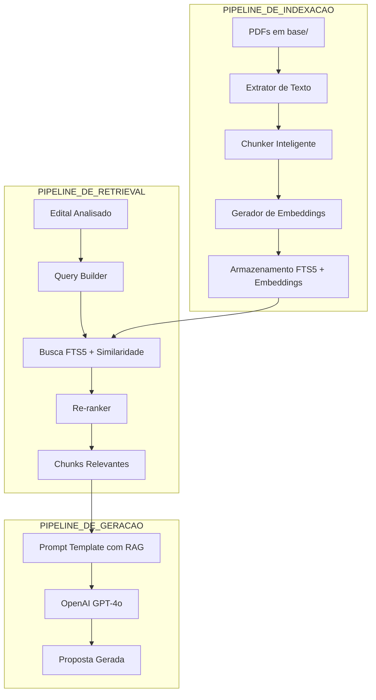

# 🧠 Plano de Implementação: RAG Interno — Capta+

> **Data:** 04/06/2026
> **Status:** Planejamento
> **Objetivo:** Construir um sistema de Retrieval-Augmented Generation (RAG) interno que utilize os documentos de referência da pasta `base/` para fundamentar a geração de propostas técnicas via IA.

---

## 📋 Contexto e Justificativa

### Problema Atual
O [`ProposalWriter`](lib/ai/writer.ts:30) atual gera propostas usando apenas:
1. Dados do edital (extraídos pela Fase 1)
2. Busca web via Tavily ([`search.service.ts`](lib/ai/search.service.ts:1))
3. Proposta livre do usuário

**Falta o "RAG interno"** — a capacidade de recuperar trechos relevantes dos manuais e referências que a instituição já possui na pasta `base/`.

### Documentos Disponíveis em `base/`

| # | Arquivo | Conteúdo | Chunks Estimados |
|---|---------|----------|-----------------|
| 1 | `101_dicas_de_captacao_de_recursos.pdf` | 101 dicas práticas de captação (Howard Fisher) | ~30 |
| 2 | `Dicas-Captacao-de-Recursos.pdf` | Dicas de captação (variante) | ~30 |
| 3 | `gil_como_elaborar_projetos_de_pesquisa_-anto.pdf` | Metodologia de projetos de pesquisa (Antonio Carlos Gil) — 14 capítulos | ~200 |
| 4 | `Manual do Proponente_LEI ROUANET.pdf` | Manual oficial Lei Rouanet 2026 — SALIC, preenchimento, orçamento, execução | ~300 |
| 5 | `Manual_de_Elaboração_e_Gestão_de_Projetos_Culturais_(Portal_do_Incentivo).pdf` | 5 módulos: conceitos, SALIC, planejamento técnico, orçamento, execução | ~250 |
| 6 | `Manual_para_Elaboração_de_Apresentação_Comercial_-_Portal_do_Incentivo.pdf` | Apresentação comercial para captação | ~50 |
| 7 | `Modelo_de_Projeto_de_Pesquisa_CAPES.pdf` | Modelo CAPES com 15 itens obrigatórios | ~15 |
| 8 | `Modelo_de_Projeto_de_Pesquisa2.pdf` | Modelo alternativo de projeto de pesquisa | ~15 |
| 9 | `TD_2926_Web.pdf` | Documento técnico | ~50 |

**Total estimado: ~940 chunks**

---

## 🏗️ Arquitetura do Sistema



### Decisão Arquitetural: FTS5 vs Embeddings Vetoriais

| Critério | FTS5 SQLite | Embeddings OpenAI + Store |
|----------|-------------|---------------------------|
| Complexidade | ✅ Baixa (já disponível) | ⚠️ Média (nova dependência) |
| Custo | ✅ Zero | ⚠️ Custo por embedding |
| Qualidade | ⚠️ Busca por关键词 | ✅ Busca semântica |
| Manutenção | ✅ Simples | ⚠️ Re-indexação periódica |

**Decisão:** Implementar em **duas fases**:
- **Fase A:** FTS5 (rápido, funcional, zero custo adicional)
- **Fase B:** Embeddings OpenAI (upgrade de qualidade semântica)

---

## 📐 Detalhamento Técnico

### 1. Schema do Banco de Dados

Nova tabela `rag_chunks` no SQLite:

```typescript
// lib/database/schema.ts — adicionar:
export const ragChunks = sqliteTable('rag_chunks', {
  id: integer('id').primaryKey({ autoIncrement: true }),
  
  // Identificação do documento fonte
  documentoNome: text('documento_nome').notNull(),      // nome do arquivo PDF
  documentoTipo: text('documento_tipo', {
    enum: ['manual', 'modelo', 'dicas', 'tecnico', 'legislacao']
  }).notNull(),
  
  // Conteúdo do chunk
  titulo: text('titulo').notNull(),                      // título da seção/capítulo
  conteudo: text('conteudo').notNull(),                  // texto do chunk
  paginaInicio: integer('pagina_inicio'),                // página de origem
  paginaFim: integer('pagina_fim'),
  
  // Metadados para retrieval
  tags: text('tags'),                                    // JSON array de tags
  categoria: text('categoria'),                          // ex: 'orcamento', 'metodologia', 'justificativa'
  
  // Embedding (Fase B)
  embedding: text('embedding'),                          // JSON array de floats
  
  // Controle
  hashConteudo: text('hash_conteudo').notNull(),         // para evitar duplicatas
  criadoEm: text('criado_em').default('CURRENT_TIMESTAMP'),
}, (table) => ({
  docIdx: index('idx_rag_documento').on(table.documentoNome),
  catIdx: index('idx_rag_categoria').on(table.categoria),
}));

// Tabela FTS5 para busca full-text
// Criada via migration SQL:
// CREATE VIRTUAL TABLE rag_chunks_fts USING fts5(
//   titulo, conteudo, tags, categoria,
//   content='rag_chunks', content_rowid='id'
// );
```

### 2. Módulo de Extração e Chunking

```typescript
// lib/rag/pdf-extractor.ts
interface ChunkMetadata {
  documentoNome: string;
  documentoTipo: 'manual' | 'modelo' | 'dicas' | 'tecnico' | 'legislacao';
  titulo: string;
  paginaInicio?: number;
  paginaFim?: number;
  tags: string[];
  categoria: string;
}

interface ExtractedChunk {
  conteudo: string;
  metadata: ChunkMetadata;
}
```

**Estratégia de Chunking:**
- **Chunk size:** 800-1200 tokens (≈ 3000-4500 caracteres)
- **Overlap:** 200 tokens entre chunks adjacentes
- **Delimitadores inteligentes:** Respeitar seções (##, Módulo, Capítulo), parágrafos e frases
- **Metadados automáticos:** Extrair título da seção, detectar categoria por conteúdo

**Categorização automática por keywords:**
```typescript
const CATEGORIA_KEYWORDS = {
  orcamento: ['orçamento', 'custo', 'valor', 'rubrica', 'despesa', 'verba'],
  metodologia: ['metodologia', 'etapa', 'cronograma', 'atividade', 'plano'],
  justificativa: ['justificativa', 'relevância', 'impacto', 'necessidade'],
  elegibilidade: ['proponente', 'elegibilidade', 'requisito', 'documento'],
  acessibilidade: ['acessibilidade', 'deficiência', 'libras', 'audiodescrição'],
  prestacao_contas: ['prestação', 'contas', 'comprovação', 'relatório'],
  captação: ['captação', 'patrocínio', 'doação', 'incentivo', 'renúncia'],
};
```

### 3. Módulo de Retrieval

```typescript
// lib/rag/retriever.ts

interface RetrievalQuery {
  texto: string;                    // query de busca
  categorias?: string[];            // filtrar por categorias
  documentos?: string[];            // filtrar por documento fonte
  maxChunks?: number;               // default: 5
  minScore?: number;                // threshold mínimo de relevância
}

interface RetrievedChunk {
  conteudo: string;
  metadata: ChunkMetadata;
  score: number;                    // score de relevância (0-1)
}

async function retrieveChunks(query: RetrievalQuery): Promise<RetrievedChunk[]>
```

**Estratégia de busca (Fase A - FTS5):**
1. Busca FTS5 com `MATCH` no título + conteúdo
2. Ranqueamento por BM25 (built-in do FTS5)
3. Filtro por categoria/documento se especificado
4. Retorna top-N chunks

**Estratégia de busca (Fase B - Embeddings):**
1. Gerar embedding da query via `text-embedding-3-small`
2. Calcular similaridade cosseno com embeddings armazenados
3. Combinar score FTS5 + score embedding (hybrid search)
4. Re-ranquear por relevância combinada

### 4. Integração com ProposalWriter

Modificar [`gerarPromptCompleto()`](lib/ai/prompts-projeto.ts:43) e [`gerarPromptSecao()`](lib/ai/prompts-projeto.ts:210) para injetar chunks RAG:

```typescript
// Adicionar ao prompt existente:
const CONTEXTO_RAG = `
REFERÊNCIAS INTERNAS (Manuais e Modelos da Instituição):
${ragChunks.map((c, i) => 
  `[REF-${i+1}] ${c.metadata.titulo} (${c.metadata.documentoNome}):\n${c.conteudo}`
).join('\n\n')}
`;

// Injetar após "DADOS DE BUSCA" no prompt existente
```

### 5. Script de Indexação

```typescript
// scripts/indexar-rag.ts
// Executa: npx tsx scripts/indexar-rag.ts

async function main() {
  const pdfs = await listPDFs('base/');
  
  for (const pdf of pdfs) {
    const texto = await extrairTexto(pdf);
    const chunks = await chunkTexto(texto, pdf);
    
    for (const chunk of chunks) {
      const hash = computeHash(chunk.conteudo);
      const existente = await db.select().from(ragChunks)
        .where(eq(ragChunks.hashConteudo, hash));
      
      if (!existente.length) {
        await db.insert(ragChunks).values({
          documentoNome: chunk.metadata.documentoNome,
          documentoTipo: chunk.metadata.documentoTipo,
          titulo: chunk.metadata.titulo,
          conteudo: chunk.conteudo,
          tags: JSON.stringify(chunk.metadata.tags),
          categoria: chunk.metadata.categoria,
          hashConteudo: hash,
        });
      }
    }
  }
  
  // Atualizar índice FTS5
  await db.run(sql`INSERT INTO rag_chunks_fts(rag_chunks_fts) VALUES('rebuild')`);
}
```

---

## 📦 Dependências Necessárias

| Pacote | Uso | Fase |
|--------|-----|------|
| `pdf-parse` | ✅ Já instalado | A |
| `tiktoken` | Contagem de tokens para chunking | A |
| `openai` | ✅ Já instalado (embeddings) | B |

---

## 🗓️ Plano de Execução

### Fase A — RAG com FTS5 (Fundamental)

- [ ] **A1.** Criar tabela `rag_chunks` e FTS5 no schema Drizzle
- [ ] **A2.** Criar migration SQL para as novas tabelas
- [ ] **A3.** Implementar [`lib/rag/pdf-extractor.ts`](lib/rag/pdf-extractor.ts) — extração de texto com `pdf-parse`
- [ ] **A4.** Implementar [`lib/rag/chunker.ts`](lib/rag/chunker.ts) — chunking inteligente com categorização automática
- [ ] **A5.** Implementar [`lib/rag/indexer.ts`](lib/rag/indexer.ts) — indexação no SQLite + FTS5
- [ ] **A6.** Implementar [`lib/rag/retriever.ts`](lib/rag/retriever.ts) — busca FTS5 com BM25
- [ ] **A7.** Criar script [`scripts/indexar-rag.ts`](scripts/indexar-rag.ts) — executar indexação dos PDFs
- [ ] **A8.** Integrar retrieval em [`lib/ai/prompts-projeto.ts`](lib/ai/prompts-projeto.ts) — injetar chunks no prompt
- [ ] **A9.** Testar geração de proposta com RAG vs sem RAG

### Fase B — Upgrade para Embeddings (Opcional)

- [ ] **B1.** Adicionar coluna `embedding` na tabela `rag_chunks`
- [ ] **B2.** Implementar geração de embeddings via `text-embedding-3-small`
- [ ] **B3.** Implementar busca híbrida (FTS5 + cosine similarity)
- [ ] **B4.** Implementar re-ranking combinado
- [ ] **B5.** Benchmark comparativo FTS5 vs Embeddings

### Fase C — Integração com Fase 2 do Prompt (Viabilidade)

- [ ] **C1.** Criar tabela `perfil_instituicao` no schema
- [ ] **C2.** Implementar prompt de matching edital × perfil
- [ ] **C3.** Implementar [`lib/ai/viability-scorer.ts`](lib/ai/viability-scorer.ts)
- [ ] **C4.** Integrar score de viabilidade na UI

---

## 🧪 Critérios de Aceitação

1. **Indexação:** Todos os 9 PDFs da pasta `base/` são indexados com sucesso
2. **Retrieval:** Dado um edital de "projeto cultural Lei Rouanet", o sistema retorna chunks relevantes dos manuais de Lei Rouanet e projetos culturais
3. **Geração:** A proposta gerada cita trechos dos manuais internos quando relevante
4. **Performance:** Retrieval em < 200ms para qualquer query
5. **Idempotência:** Re-executar o script de indexação não duplica chunks

---

## 📊 Métricas de Sucesso

| Métrica | Antes (sem RAG) | Depois (com RAG) |
|---------|-----------------|-------------------|
| Fundamentação da proposta | Apenas Tavily web | Tavily + Manuais internos |
| Conformidade Lei Rouanet | Dependente do modelo | Guiada por manual oficial |
| Citações em justificativa | Genéricas | Específicas dos manuais |
| Score de compliance | ~60-70% estimado | Meta: >80% |
